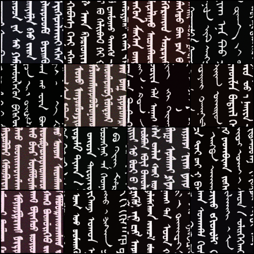

# Mongolian-Script-Generator

Mongolian Script Generator (Implemented by Diffusion model, 2022/01/27)



This code is by Sodoo

## How To Use 


1. Clone this repository
```
$cd gitclone https://github.com/DL-Circle/Mongolian-Script-Generator
```

2. Generating 

Download pretrained model from [here]() (Coming Soon...)

```
$python3 generate.py -w model.pt --num_sample 16
```

3. Training

Train dataset is available from [here](https://drive.google.com/file/d/1s9t22tRI22uolUv1bv023xj-x68gu1dp/edit) 

```
$python3 train.py --datafolder /path/to/imagefolder --batchsize 4 --epochs 50000
```

## Citations 

```bibtex
@misc{lucidrains,
    title   = {denoising-diffusion-pytorch},
    author  = {lucidrains},
    year    = {2021},
    publisher = {GitHub},
    journal = {GitHub repository}
    howpublished = {https://github.com/lucidrains/denoising-diffusion-pytorch}
    commit = {91cff459394b784f870f3998023439796c95b7ca}
}
```

```bibtex
@misc{openai,
    title   = {improved-diffusion},
    author  = {Alex Nichol and Prafulla Dhariwal},
    year    = {2021},
    publisher = {GitHub},
    journal = {GitHub repository}
    howpublished = {https://github.com/openai/improved-diffusion}
    commit = {783b6740edb79fdb7d063250db2c51cc9545dcd1}
}
```

```bibtex
@misc{openai,
    title   = {guided-diffusion},
    author  = {Alex Nichol and Prafulla Dhariwal},
    year    = {2021},
    publisher = {GitHub},
    journal = {GitHub repository}
    howpublished = {https://github.com/openai/guided-diffusion}
    commit = {27c20a8fab9cb472df5d6bdd6c8d11c8f430b924}
}
```

